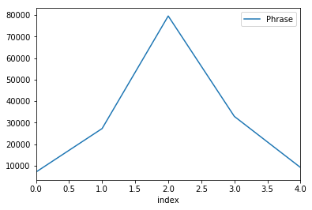

# Sentiment Analysis on Movie Reviews 
#### Problem of Sequance Classification 
Classifying whether a review is positive or negative and other 3 categories

### Kaggle competition link
Classify the sentiment of sentences from the Rotten Tomatoes dataset.
https://www.kaggle.com/c/sentiment-analysis-on-movie-reviews/submissions?sortBy=date&group=all&page=1


```python
import numpy as np

import h5py
import keras

from keras.utils import np_utils

from keras.models import model_from_yaml

from keras.models import Sequential

from keras.layers import LSTM, Dense, Dropout
from keras.layers.convolutional import Conv1D, MaxPooling1D
from keras.layers.embeddings import Embedding

from keras.preprocessing import sequence

from gensim import corpora
from nltk.corpus import stopwords
from nltk.tokenize import word_tokenize 
from nltk.stem import SnowballStemmer

# download nltk assets
#import nltk
#nltk.download()

import pandas as pd

import matplotlib.pyplot as plt
%matplotlib inline

np.random.seed(7)
```

    Using Theano backend.


```python
# reading rotten tomatoes train data
train_data = pd.read_csv("train.tsv", sep='\t')
test_data = pd.read_csv("test.tsv", sep='\t')
```


```python
# inspect the training data
train_data.info()
# losing the phrase and sentance id
train_data_i = train_data.drop(['PhraseId', 'SentenceId'], axis=1)
# taking a look at the data  
print(train_data_i.head())
# counting number of phrases in every sentiment type
print(train_data_i.groupby(('Sentiment')).count())
```

    <class 'pandas.core.frame.DataFrame'>
    RangeIndex: 156060 entries, 0 to 156059
    Data columns (total 4 columns):
    PhraseId      156060 non-null int64
    SentenceId    156060 non-null int64
    Phrase        156060 non-null object
    Sentiment     156060 non-null int64
    dtypes: int64(3), object(1)
    memory usage: 4.8+ MB
                                                  Phrase  Sentiment
    0  A series of escapades demonstrating the adage ...          1
    1  A series of escapades demonstrating the adage ...          2
    2                                           A series          2
    3                                                  A          2
    4                                             series          2
               Phrase
    Sentiment        
    0            7072
    1           27273
    2           79582
    3           32927
    4            9206


```python
# visualizing how much the data is biased towards certain sentiment
sentiment_count = train_data_i.groupby(('Sentiment')).count()
sentiment_count['index'] = range(0, 5)
print(sentiment_count)
sentiment_count.plot(x='index', y='Phrase')
```

               Phrase  index
    Sentiment               
    0            7072      0
    1           27273      1
    2           79582      2
    3           32927      3
    4            9206      4


    <matplotlib.axes._subplots.AxesSubplot at 0x7feb401ee518>





```python
# raw data 
raw_docs_train = train_data['Phrase'].values
raw_docs_test = test_data['Phrase'].values
sentiment_train = train_data['Sentiment'].values
num_labels = len(np.unique(sentiment_train))
```


```python
#text pre-processing
stop_words = set(stopwords.words('english'))
stop_words.update(['.', ',', '"', "'", ':', ';', '(', ')', '[', ']', '{', '}'])
stemmer = SnowballStemmer('english')

print ("pre-processing train docs...")
processed_docs_train = []
for doc in raw_docs_train:
   tokens = word_tokenize(doc)
   filtered = [word for word in tokens if word not in stop_words]
   stemmed = [stemmer.stem(word) for word in filtered]
   processed_docs_train.append(stemmed)

print ("pre-processing test docs...")
processed_docs_test = []
for doc in raw_docs_test:
   tokens = word_tokenize(doc)
   filtered = [word for word in tokens if word not in stop_words]
   stemmed = [stemmer.stem(word) for word in filtered]
   processed_docs_test.append(stemmed)

processed_docs_all = np.concatenate((processed_docs_train, processed_docs_test), axis=0)

```

    pre-processing train docs...
    pre-processing test docs...


```python
dictionary = corpora.Dictionary(processed_docs_all)
dictionary_size = len(dictionary.keys())
print ("dictionary size: ", dictionary_size)
#dictionary.save('dictionary.dict')
#corpus = [dictionary.doc2bow(doc) for doc in processed_docs]

print ("converting to token ids...")
word_id_train, word_id_len = [], []
for doc in processed_docs_train:
    word_ids = [dictionary.token2id[word] for word in doc]
    word_id_train.append(word_ids)
    word_id_len.append(len(word_ids))

word_id_test, word_ids = [], []
for doc in processed_docs_test:
    word_ids = [dictionary.token2id[word] for word in doc]
    word_id_test.append(word_ids)
    word_id_len.append(len(word_ids))

seq_len = np.round((np.mean(word_id_len) + 2*np.std(word_id_len))).astype(int)

#pad sequences
word_id_train = sequence.pad_sequences(np.array(word_id_train), maxlen=seq_len)
word_id_test = sequence.pad_sequences(np.array(word_id_test), maxlen=seq_len)
y_train_enc = np_utils.to_categorical(sentiment_train, num_labels)
```

    dictionary size:  13759
    converting to token ids...


```python
# model define
embedding_vector_length = 128

model = Sequential()

model.add(Embedding(dictionary_size, embedding_vector_length))
model.add(Dropout(0.2))

model.add(Conv1D(filters=32, kernel_size=3, kernel_initializer='uniform', padding='same', activation='relu'))
model.add(MaxPooling1D(pool_size=2))

model.add(LSTM(100, dropout=0.2, recurrent_dropout=0.2))
# model.add(LSTM(100))

model.add(Dense(num_labels, kernel_initializer='uniform', activation='sigmoid'))

model.compile(loss='categorical_crossentropy', optimizer='adam', metrics=['accuracy'])

print(model.summary())
```

    _________________________________________________________________
    Layer (type)                 Output Shape              Param #   
    =================================================================
    embedding_1 (Embedding)      (None, None, 128)         1761152   
    _________________________________________________________________
    dropout_1 (Dropout)          (None, None, 128)         0         
    _________________________________________________________________
    conv1d_1 (Conv1D)            (None, None, 32)          12320     
    _________________________________________________________________
    max_pooling1d_1 (MaxPooling1 (None, None, 32)          0         
    _________________________________________________________________
    lstm_1 (LSTM)                (None, 100)               53200     
    _________________________________________________________________
    dense_1 (Dense)              (None, 5)                 505       
    =================================================================
    Total params: 1,827,177
    Trainable params: 1,827,177
    Non-trainable params: 0
    _________________________________________________________________
    None


```python
# fit model start training 
#     model.fit(X_train, y_train, validation_data=(X_test, y_test), epochs=3, batch_size=64, verbose=1)
model.fit(word_id_train, y_train_enc, epochs=20, batch_size=64, verbose=1)
```

    Epoch 1/20
    156060/156060 [==============================] - 223s - loss: 1.0596 - acc: 0.5754   
    Epoch 2/20
    156060/156060 [==============================] - 232s - loss: 0.8460 - acc: 0.6512   
    Epoch 3/20
    156060/156060 [==============================] - 228s - loss: 0.7808 - acc: 0.6756   
    Epoch 4/20
    156060/156060 [==============================] - 226s - loss: 0.7437 - acc: 0.6905   
    Epoch 5/20
    156060/156060 [==============================] - 226s - loss: 0.7156 - acc: 0.7037   
    Epoch 6/20
    156060/156060 [==============================] - 227s - loss: 0.6933 - acc: 0.7115   
    Epoch 7/20
    156060/156060 [==============================] - 227s - loss: 0.6742 - acc: 0.7174   
    Epoch 8/20
    156060/156060 [==============================] - 236s - loss: 0.6562 - acc: 0.7248   
    Epoch 9/20
    156060/156060 [==============================] - 242s - loss: 0.6421 - acc: 0.7309   
    Epoch 10/20
    156060/156060 [==============================] - 240s - loss: 0.6301 - acc: 0.7335   
    Epoch 11/20
     29824/156060 [====>.........................] - ETA: 202s - loss: 0.5819 - acc: 0.7545


```python
# serialize model to YAML
model_yaml = model.to_yaml()
with open("rotten_model.yaml", "w") as yaml_file:
    yaml_file.write(model_yaml)
# serialize weights to HDF5
model.save_weights("rotten_weights.h5")
print("Saved model to disk")
```


```python
# can not evaluate because do not have the y_test
# # Final evaluation of the model
# scores = model.evaluate(word_id_test, y_test, verbose=0)
# print("Accuracy: %.2f%%" % (scores[1]*100))

test_pred = model.predict_classes(word_id_test)

#make a submission
test_data['Sentiment'] = test_pred.reshape(-1,1) 
header = ['PhraseId', 'Sentiment']
test_data.to_csv('./lstm_sentiment.csv', columns=header, index=False, header=True)
```
